# Quaternion-Based Drone Attitude Stabilization

## Drones_S5_CD10_Quarternion_Drone_Stabilization

<p align="center">
  
</p>

<p align="center"><b>Amrita Vishwa Vidyapeetham</b></p>

---

## Team Members

| Name | Roll Number | Email |
|---|---|---|
| Gautham T | CB.SC.U4AIE24264 | cb.sc.u4aie24264@cb.students.amrita.edu |
| Reshwanth R | CB.SC.U4AIE24246 | cb.sc.u4aie24246@cb.students.amrita.edu |
| Kaushik Ram S | CB.SC.U4AIE24266 | cb.sc.u4aie24266@cb.students.amrita.edu |
| Praveen Reddy | CB.SC.U4AIE24243 | cb.sc.u4aie24243@cb.students.amrita.edu |

---

# Abstract

This project presents the development and simulation of a quaternion-based
attitude stabilization system for a quadrotor unmanned aerial vehicle (UAV).

The system investigates the ability of a simulated 6-DOF quadrotor to estimate
its orientation from a noisy IMU, compute a singularity-free attitude error,
and generate torque commands that recover the vehicle to a desired attitude.

Two attitude-control representations were compared during development:

1. Quaternion-error PID
2. Euler-angle PID

The quaternion controller is used as the primary inner-loop law because it
remains well-defined at large pitch angles. Euler-angle control is retained as
a baseline to demonstrate gimbal lock in the closed loop.

The project combines rigid-body UAV dynamics, unit-quaternion kinematics,
IMU modelling, complementary sensor fusion, PID control, and motor mixing.

---

# 1. Introduction

Unmanned Aerial Vehicles have become increasingly important in
surveillance, inspection, search and rescue, autonomous navigation,
agriculture, and aerial robotics.

One important capability for autonomous UAVs is stable attitude control
using onboard inertial sensors. Roll, pitch, and yaw must remain
controllable even during large-angle manoeuvres.

Euler-angle representations are convenient near hover, but they become
singular near \(\pm 90^\circ\) pitch. At that point roll and yaw describe
the same motion, and a controller that inverts the Euler kinematic map
can command unbounded torque.

In this project, the UAV orientation is represented by a unit quaternion.
A Mahony complementary filter fuses gyroscope and accelerometer measurements
into an estimated quaternion. The vector part of the quaternion error is
used as the PID error signal.

The overall objective is to investigate a complete quaternion attitude
pipeline in simulation, and to compare it against Euler-angle control,
before considering physical deployment on an MPU-6050 class IMU.

---

# 2. Objectives

The major objectives of the project are:

- Develop a simulated 6-DOF quadrotor attitude-stabilization system.
- Represent orientation using a unit quaternion.
- Model gyroscope and accelerometer measurements from a noisy IMU.
- Estimate attitude using Mahony complementary filtering.
- Compute quaternion attitude error relative to a desired orientation.
- Generate torque commands using PID control on the quaternion error.
- Mix torque and thrust commands into four motor outputs.
- Investigate large-angle recovery from an inverted-like pitch.
- Compare quaternion PID against Euler-angle PID near gimbal lock.
- Track commanded attitude steps with the inner loop.
- Fly a cascaded 6-DOF figure-eight trajectory under wind gusts.
- Provide a hardware mapping for later MPU-6050 implementation.

---

# 3. Literature Review

## 3.1 Quaternion-based Adaptive Backstepping Fast Terminal Sliding Mode Control

The first base paper investigates quadrotor control using unit-quaternion
attitude, quaternion error, and rigid-body rotational dynamics.

The work provides the theoretical motivation for using a singularity-free
quaternion representation instead of Euler angles, together with a
comparison against conventional attitude control.

This project keeps the paper’s quaternion geometry and plant model, while
replacing adaptive backstepping and sliding-mode laws with a PID that can
be tuned on a table-top IMU.

**Base Paper:**

> Quaternion-based Adaptive Backstepping Fast Terminal Sliding Mode Control for Quadrotor UAVs with Finite Time Convergence

https://arxiv.org/abs/2407.01275

---

## 3.2 Nonlinear Complementary Filters on the Special Orthogonal Group

The second base paper investigates attitude estimation from IMU measurements
using complementary filters on \(\mathrm{SO}(3)\).

The work provides relevant background for understanding how gyroscope
integration can be corrected using accelerometer gravity measurements,
which is the role of the Mahony filter in this project.

**Base Paper:**

> Nonlinear complementary filters on the special orthogonal group

https://ieeexplore.ieee.org/document/4608934

---

# 4. Research Gap

Existing UAV attitude-control approaches often depend on advanced nonlinear
laws, Lyapunov-based adaptation, gimbal systems, or highly developed
autopilot platforms.

Euler-angle PID is easy to implement, but it fails at large pitch angles
because the kinematic Jacobian loses rank.

This project focuses on developing and experimentally evaluating a
simulation-based quaternion pipeline using accessible Python simulation
and laboratory-scale IMU assumptions.

The project particularly investigates:

- Unit-quaternion attitude representation.
- Quaternion-error PID.
- IMU noise, bias, and complementary fusion.
- Closed-loop recovery from large pitch angles.
- Direct comparison against Euler-angle control near gimbal lock.
- Cascaded position control for a 6-DOF trajectory.
- Hardware mapping toward an MPU-6050 implementation.

---

# 5. System Architecture

The overall system can be represented as:

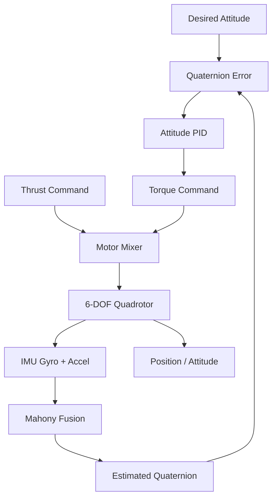

---

## 6. Methodology

### 6.1 Quadrotor Plant

A rigid-body quadrotor is simulated in an ENU frame with \(z\) pointing up.

The vehicle state includes:

- Position
- Linear velocity
- Unit quaternion
- Body angular velocity

Attitude-only experiments freeze translation so that orientation can be
studied independently. The figure-eight mission uses the full 6-DOF plant.

---

### 6.2 IMU Acquisition

The simulated IMU provides body-frame gyroscope and accelerometer
measurements with bias and white noise.

The accelerometer reports specific force, so a level vehicle at rest
reads gravity along body-\(z\).

These measurements are the only attitude sensing used by the controller.

---

### 6.3 Attitude Estimation

Gyroscope measurements are integrated using the quaternion exponential map.

Accelerometer gravity is compared with the estimated down direction.
The cross-product error corrects gyro drift inside the Mahony filter.

The filter output is a unit quaternion used by the attitude controller.

---

### 6.4 Attitude Control

The desired and estimated quaternions are combined into an error quaternion.

The vector part of that error is the PID input. Gyro rate damping
provides derivative action.

An Euler-angle PID with kinematic inversion is implemented as a baseline
so that gimbal lock can be shown under identical plant, IMU, and gains.

---

## 7. Mathematical Formulation

Let the unit quaternion, scalar first, be:

$$
q = [q_0,\, q_1,\, q_2,\, q_3], \qquad \|q\| = 1
$$

Quaternion kinematics are:

$$
\dot q = \tfrac12\, q \otimes [0,\, \omega]
$$

The exponential-map integration step used in code is:

$$
q \leftarrow q \otimes \bigl[\cos(\theta/2),\; \hat n \sin(\theta/2)\bigr]
$$

where \(\theta = \|\omega\|\,\Delta t\).

---

### 7.1 Mahony Sensor Fusion

Let \(v_{\mathrm{acc}}\) be the measured accelerometer direction and
\(v_{\mathrm{est}}\) the estimated gravity direction in the body frame.

The complementary-filter correction is:

$$
e = v_{\mathrm{acc}} \times v_{\mathrm{est}}
$$

$$
\omega_{\mathrm{corr}} = \omega + K_{p,f}\, e + K_{i,f} \int e\, dt
$$

The corrected rate is integrated into the estimated quaternion.

Yaw is not observable from the accelerometer alone.

---

### 7.2 Quaternion Attitude Error

Let \(q_d\) be the desired attitude and \(q\) the estimated attitude.

The error quaternion is:

$$
q_e = q_d \otimes q^{-1}
$$

Identity means the vehicle is already at the target:

$$
q_e = [1,\, 0,\, 0,\, 0]
$$

The shortest rotation is selected by flipping the sign if \(q_{e0} < 0\),
because \(q\) and \(-q\) represent the same orientation.

The PID error signal is the vector part:

$$
e_q = q_{e,v} = [q_{e1},\, q_{e2},\, q_{e3}]
$$

The controller attempts to drive:

$$
e_q \rightarrow 0
$$

Therefore:

$$
q \rightarrow q_d
$$

---

### 7.3 Visual / Attitude PID Control

A proportional-integral law with gyro rate damping is:

$$
u = K_p\, e_q + K_i \int e_q\, dt - K_d\, \omega
$$

where:

- \(u\) = commanded body torque
- \(e_q\) = quaternion vector error
- \(K_p, K_i, K_d\) = controller gains
- \(\omega\) = measured body rate

The same numerical gains are given to the Euler baseline. The only
change is the error representation.

---

### 7.4 Rigid-Body Plant

Translational and rotational dynamics (ENU, \(z\) up) are:

$$
\dot v = g_{\mathrm{vec}} + R(q)\,[0,0,F/m]
$$

$$
J\dot\omega = -\omega \times (J\omega) + \tau
$$

where \(F\) is collective thrust and \(\tau\) is body torque.

---

## 8. Python 6-DOF Simulation

The simulation environment is a custom Python rigid-body model.

The implementation provides:

- Simulated quadrotor
- Simulated IMU
- Mahony fusion
- Quaternion PID
- Euler PID baseline
- Motor mixing
- Wind gusts
- Real-time 3D visualization
- Presentation figures and animations

The main implementation is located at:

```
src/
simulation/
```

### Quick start

```bash
python3 -m venv .venv
source .venv/bin/activate
pip install -r requirements.txt

python -m unittest discover -s tests -v
python -m simulation.run_all
```

Live 3D window (needs a display):

```bash
python -m simulation.live_demo
```

---

## 9. IMU Modelling and Sensor Fusion

The sensing chain uses an MPU-6050-class IMU model.

The IMU environment consists of:

- Gyroscope white noise
- Gyroscope bias
- Accelerometer white noise
- Body-frame specific-force measurement
- Mahony complementary filter
- Unit-quaternion estimate at 500 Hz

The accelerometer is used to correct roll and pitch drift.
A magnetometer is not included, so heading can wander.

---

## 10. Attitude and Position Control

The project experiments with several types of UAV control:

- Quaternion-error attitude PID
- Euler-angle attitude PID
- Large-angle recovery
- Step attitude tracking
- Cascaded position control
- Figure-eight trajectory tracking

The inner loop stabilizes orientation. The outer loop converts a
desired acceleration into a thrust vector and a quaternion setpoint.

---

## 11. Quaternion versus Euler Control

Two inner-loop error representations were explored under identical
gains, plant, and IMU.

### 11.1 Quaternion PID

Quaternion PID uses the vector part of \(q_e\).

For example:

```python
err = Q.vector_error(q_desired, q_current)
u = pid.update(err, dt) - kd * omega
```

This remains defined at large pitch angles.

---

### 11.2 Euler PID

Euler PID wraps roll/pitch/yaw error and inverts the Euler kinematic
Jacobian \(E(\theta)\).

```python
tau = np.linalg.solve(E, u)
```

That map loses rank near \(\pm 90^\circ\) pitch, which is gimbal lock
inside the controller.

---

## 12. Motor Mixing and Hardware Mapping

An X-configuration mixer converts collective thrust and body torque
into four motor commands.

It provides a direct path from simulation to later hardware:

- Four ESCs on a quadrotor test stand
- Optional gimbal servo mapping \(\theta_{\mathrm{servo}} = \theta_0 + u(t)\)

The intended sensor is an MPU-6050, or equivalent, sampled at
\(\ge 200\) Hz.

Tune \(K_p\) first, then \(K_d\) to damp overshoot, then a small \(K_i\)
if a steady offset remains.

---

## 13. Closed-Loop Attitude Tracking

The IMU provides the inertial feedback required by the attitude controller.

The basic control loop is:

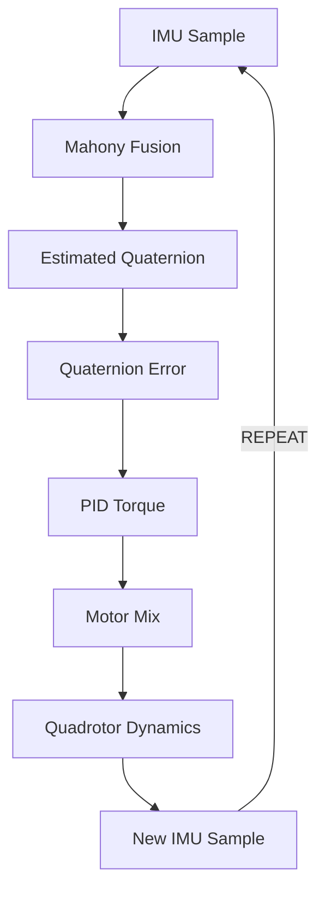

This creates a closed-loop inertial feedback system.

---

## 14. Simulation Architecture

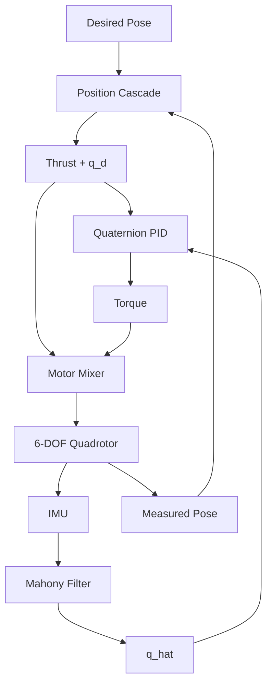

---

## 15. Results

The developed simulation environment was successfully used to investigate
UAV attitude stabilization and trajectory tracking.

### 15.1 Attitude Recovery Results

The quaternion implementation demonstrated:

- Unit-quaternion kinematics
- IMU-based attitude observation
- Mahony fusion
- Quaternion-error calculation
- PID torque generation
- Large-angle recovery
- Bounded motor commands

**Figures:**

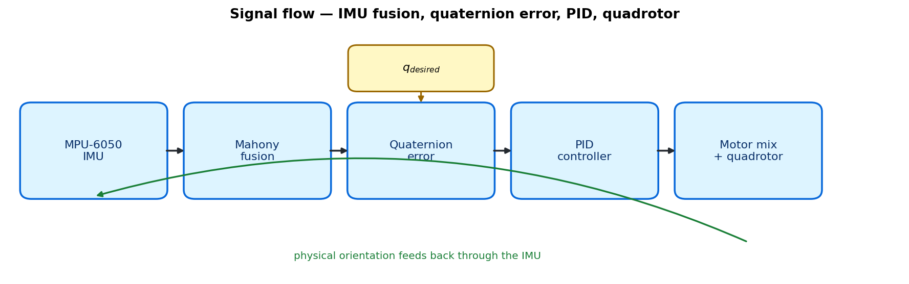

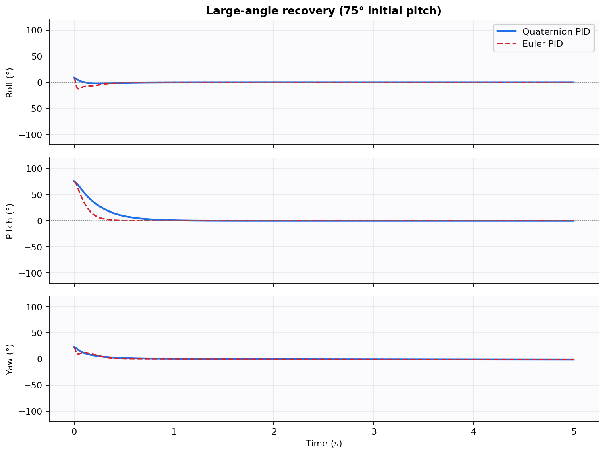

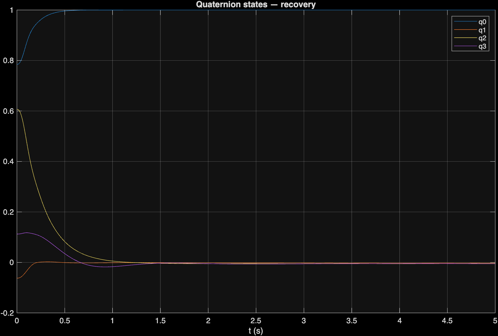

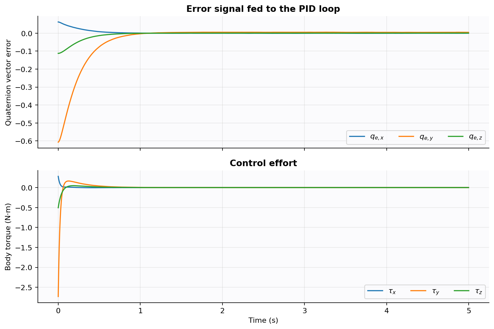

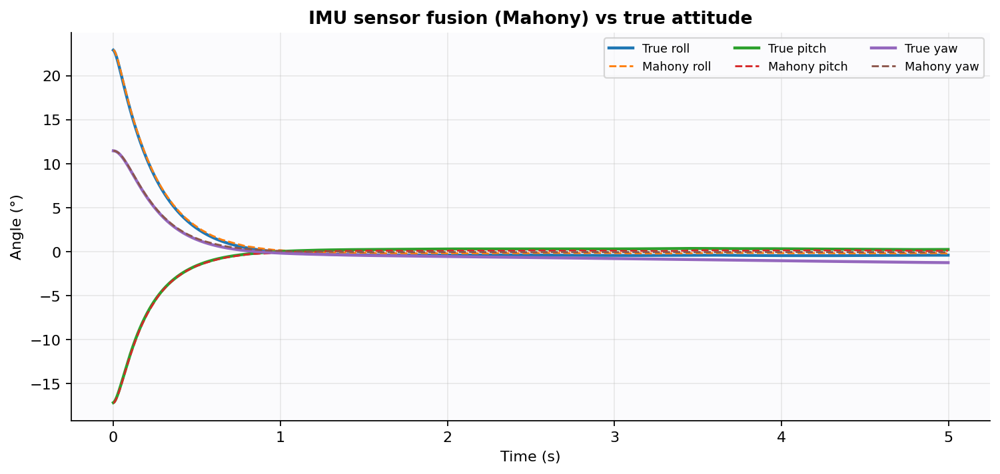

### Attitude Quantitative Results

| Case | Settling / tracking | Peak \(\|\tau\|\) |
|---|---|---:|
| 75° recovery, quaternion PID | \(< 1.2^\circ\) after 4.5 s | 2.7 N·m |
| 75° recovery, Euler PID | similar angles, more roll overshoot | 10.6 N·m |
| Gimbal lock, quaternion PID | \(< 1.0^\circ\) | 3.3 N·m |
| Gimbal lock, Euler PID | plant saturates; command peaks at 301 N·m | 301 N·m |

Quaternion components stay unit-length to numerical precision (\(\sim 10^{-16}\)).

---

### 15.2 6-DOF Trajectory Results

The cascaded implementation demonstrated:

- Successful hover takeoff
- Figure-eight path tracking
- IMU closed-loop flight
- Wind gusts after \(t = 4\) s
- Bounded inner-loop torque
- Motor mixing throughout the manoeuvre

**Figures:**

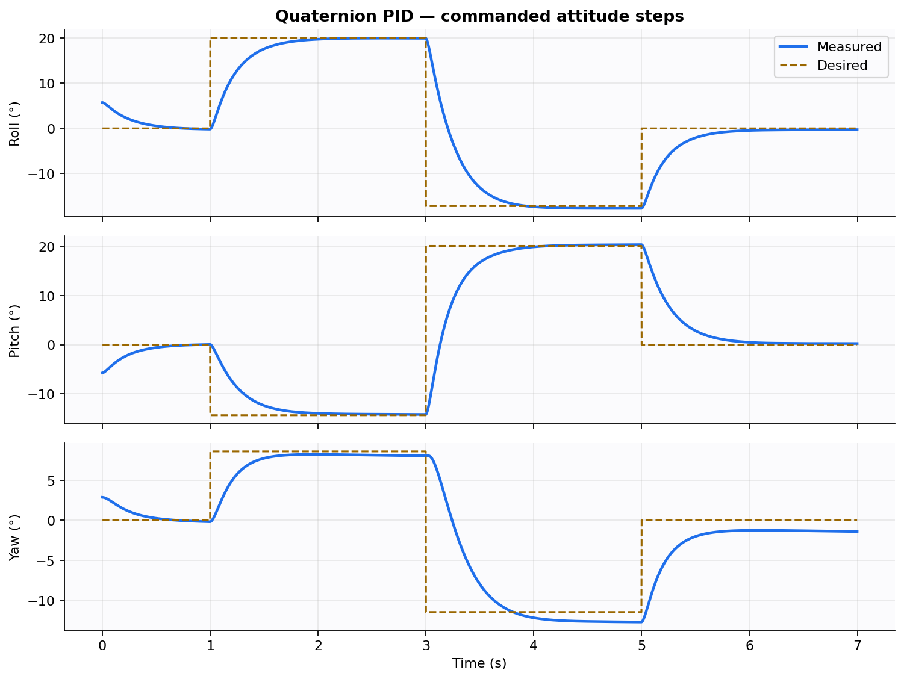

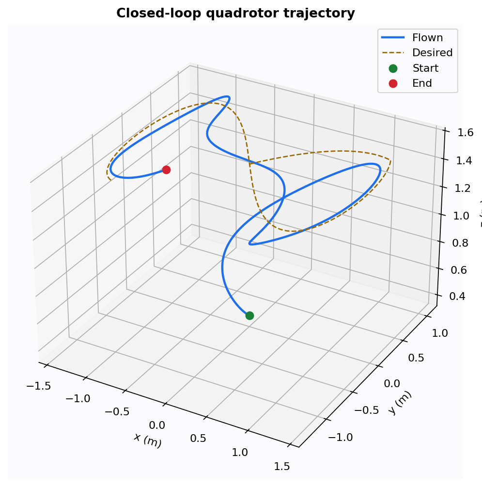

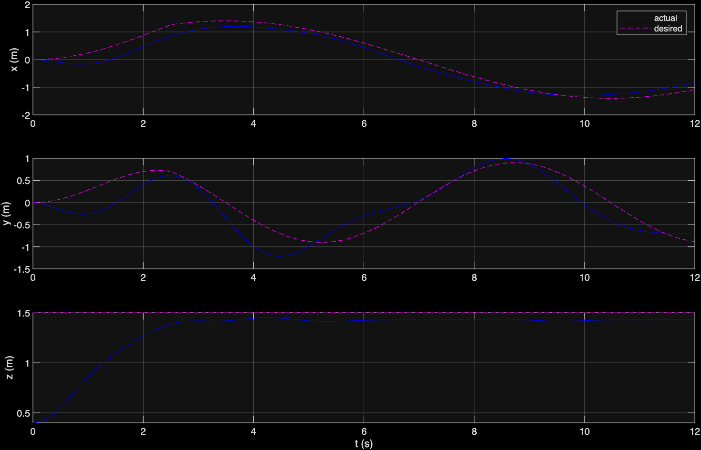

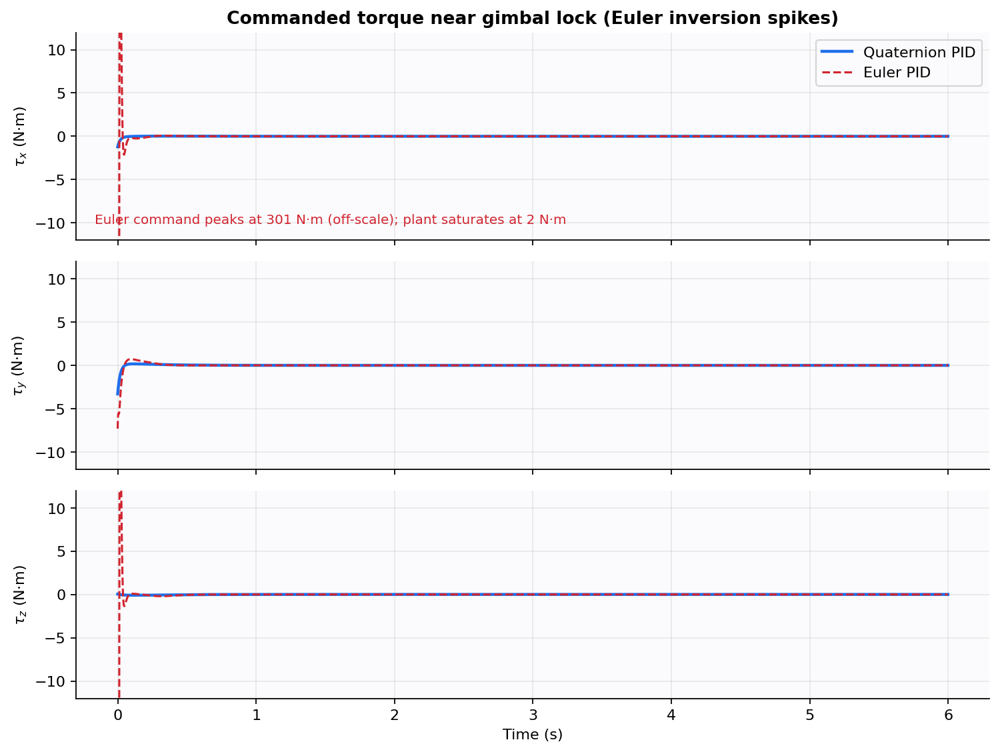

### Trajectory Quantitative Results

| Metric | Result |
|---|---:|
| Figure-eight altitude | 1.51 m |
| Mean path error under gusts | 0.39 m |
| Peak mission torque | 0.57 N·m |
| Sample time | 2 ms (500 Hz) |

Generate plots and GIFs with:

```bash
python -m simulation.run_all
```

Metrics are written to `results/data/metrics.json`.

---

## 16. Comparison of Attitude Representations

| Feature | Quaternion PID | Euler PID |
|---|---|---|
| UAV simulation | Yes | Yes |
| IMU fusion | Yes | Yes |
| Position cascade | Yes | Not used as primary |
| Singularity-free error | Yes | No |
| Large-angle recovery | Stable | Overshoot / inversion risk |
| Near \(\pm 90^\circ\) pitch | Bounded torque | Unbounded command |
| Peak torque, gimbal case | 3.3 N·m | 301 N·m |
| Hardware mapping | Direct | Fragile at large tilt |
| Development complexity | Moderate | Lower near hover |

---

## 17. Repository Structure

```
quaternion-drone-stabilization/

├── README.md
├── requirements.txt
├── docs/
│   └── PROJECT_BRIEF.md
├── src/
│   ├── quaternion.py
│   ├── mahony.py
│   ├── pid.py
│   ├── imu.py
│   ├── quadrotor.py
│   ├── controllers.py
│   └── mixer.py
├── simulation/
│   ├── scenarios.py
│   ├── figures.py
│   ├── animate.py
│   ├── run_all.py
│   └── live_demo.py
├── tests/
│   ├── test_quaternion.py
│   └── test_closed_loop.py
├── presentation/
│   ├── slides.html
│   ├── viewer.html
│   └── SPEAKER_NOTES.md
└── results/
    ├── figures/
    ├── animations/
    └── data/
```

---

## 18. Verification

The system was considered operational when:

- Unit tests passed for quaternion algebra and \(\mathrm{SO}(3)\) maps.
- Exponential-map integration preserved \(\|q\| = 1\).
- Mahony roll/pitch estimates converged from a wrong initial quaternion.
- Hover thrust held altitude on the 6-DOF plant.
- Attitude-only mode did not translate the vehicle.
- Quaternion PID recovered from a 75° pitch.
- Euler gimbal-lock torque exceeded the quaternion command by a large margin.
- Step commands were tracked by the inner loop.
- Figure-eight mean position error stayed small after takeoff.
- Presentation figures and animations could be regenerated.

```bash
python -m unittest discover -s tests -v
```

---

## 19. Limitations

The current system is simulation-based.

The project does not yet guarantee performance under real-world conditions involving:

- Lighting is not relevant here, but IMU vibration is
- Sensor scale-factor error
- Temperature drift
- Wind beyond the modelled gusts
- Motor lag and propeller aerodynamics
- Communication delays
- Magnetic disturbances
- Ground effect
- Real UAV structural flexibility

The project also does not implement the paper’s adaptive backstepping or
fast terminal sliding-mode laws. Further validation using physical UAV
hardware would therefore be required.

---

## 20. Future Scope

Future improvements may include:

- MPU-6050 hardware-in-the-loop testing
- Magnetometer heading correction
- Madgwick filter comparison
- Full PID visual servoing on a gimbal
- Adaptive or sliding-mode attitude laws from the base paper
- Improved yaw control
- Camera-based attitude aiding
- 3D target localization
- Autonomous obstacle avoidance
- Real UAV deployment
- Improved trajectory planning
- Battery and motor saturation models

---

## 21. Conclusion

This project developed and investigated a simulation-based quaternion
attitude stabilization system for a quadrotor UAV.

Two complementary control representations, quaternion-error PID and
Euler-angle PID, were compared on the same plant and IMU.

The quaternion pipeline provided a convenient and singularity-free
inner loop for large-angle recovery, while the Euler baseline showed
how kinematic inversion fails near gimbal lock. Cascaded position
control then flew a 6-DOF figure-eight under gusts.

The project successfully demonstrated the complete concept of obtaining
inertial measurements from an IMU, estimating a unit quaternion,
calculating the attitude error, and using that information to generate
UAV torque commands.

The work provides a foundation for future development toward a
laboratory MPU-6050 implementation and, later, real-world quadrotor
attitude control.

---

## 22. References

1. A. Shevidi and H. A. Hashim, “Quaternion-based Adaptive Backstepping Fast Terminal Sliding Mode Control for Quadrotor UAVs with Finite Time Convergence,” arXiv:2407.01275, 2024. — [*Base Paper Link*](https://arxiv.org/abs/2407.01275)
2. R. Mahony, T. Hamel, and J.-M. Pflimlin, “Nonlinear complementary filters on the special orthogonal group,” *IEEE Transactions on Automatic Control*, 2008. — [*Base Paper Link*](https://ieeexplore.ieee.org/document/4608934)
3. H. A. Hashim, “Special Orthogonal Group SO(3), Euler Angles, Angle-axis, Rodriguez Vector and Unit-quaternion,” arXiv:1909.06669, 2019. — [*SO(3) Notes*](https://arxiv.org/abs/1909.06669)
4. PX4 Documentation — [*PX4 Documentation*](https://docs.px4.io/main/)
5. NumPy Documentation — [*NumPy Documentation*](https://numpy.org/doc/)
6. PyBullet / rigid-body simulation background — [*PyBullet Documentation*](https://pybullet.org/wordpress/)

---

## 23. Project Documentation

Detailed setup and implementation documentation is available in:

- [Project Brief](docs/PROJECT_BRIEF.md)
- [Presentation Slides](presentation/slides.html)
- [3D Viewer](presentation/viewer.html)
- [Speaker Notes](presentation/SPEAKER_NOTES.md)
- Simulation scenarios in `simulation/scenarios.py`
- Closed-loop tests in `tests/`

Default simulation parameters:

| Quantity | Value |
|---|---|
| Mass | 1.0 kg |
| Inertia | \(\mathrm{diag}(0.012,\, 0.012,\, 0.021)\) kg·m² |
| Gravity | 9.81 m/s² (ENU, \(z\) up) |
| Attitude PID | \(K_p=4.5\), \(K_i=0.15\), \(K_d=0.55\) |
| Mahony | \(K_{p,f}=1.8\), \(K_{i,f}=0.04\) |
| Sample time | 2 ms (500 Hz) |
| IMU | gyro bias + white noise, accelerometer noise |

---

## 24. Project Team

This project was developed by S5 CD10.

| Name | Roll Number | Email |
|---|---|---|
| Gautham T | CB.SC.U4AIE24264 | cb.sc.u4aie24264@cb.students.amrita.edu |
| Reshwanth R | CB.SC.U4AIE24246 | cb.sc.u4aie24246@cb.students.amrita.edu |
| Kaushik Ram S | CB.SC.U4AIE24266 | cb.sc.u4aie24266@cb.students.amrita.edu |
| Praveen Reddy | CB.SC.U4AIE24243 | cb.sc.u4aie24243@cb.students.amrita.edu |
